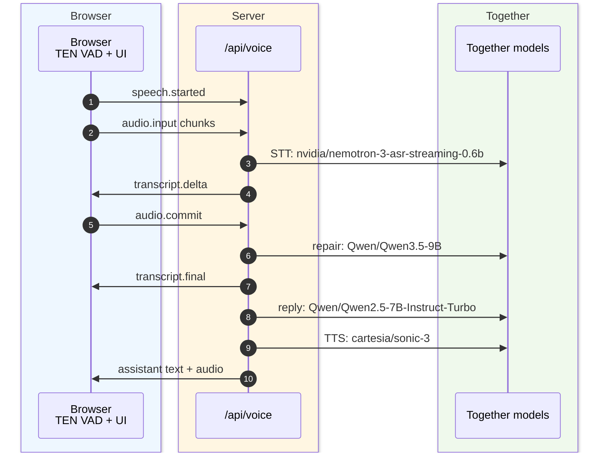

# Together Voice Demo

A tiny voice-to-voice demo for Together AI:

Browser mic -> Vercel WebSocket -> Together realtime STT -> Together chat streaming -> Together realtime TTS -> browser audio.

The browser never receives the Together API key. It only connects to `/api/voice`.

## Voice Pipeline TLDR

The important trick is that the browser does local endpointing, while Together does the actual transcription, reply, and speech generation. A speech segment ending is not always a full user turn ending: the server can pause a pending answer when the browser says speech started again.



Current event flow in words:

Classic turn flow:

1. Browser microphone records audio.
2. TEN VAD, loaded as WASM in the browser, decides when speech opens.
3. The client immediately sends `speech.started` so the server can pause pending repair or reply work.
4. The client buffers and streams `audio.input` chunks while speech is active.
5. TEN VAD decides speech ended after short silence, then the client sends `audio.commit`.
6. Together STT streams `transcript.delta` for provisional UI text, then `transcript.completed`.
7. The server merges nearby speech segments, waits `REPLY_GRACE_MS`, repairs the full transcript, and sends `transcript.final`.
8. The assistant reply uses the repaired transcript, streams text to the UI, and streams sentence chunks through TTS to browser playback.

## Run

```bash
bun install
bun run dev
```

`bun run dev` is useful for UI work, but full voice mode needs a runtime that supports WebSocket upgrades. For the working voice demo, deploy to Vercel.

Create `.env` with:

```bash
TOGETHER_API_KEY=...
```

Optional model overrides:

```bash
TOGETHER_STT_MODEL=nvidia/parakeet-tdt-0.6b-v3
TOGETHER_STT_FALLBACK_MODEL=openai/whisper-large-v3
TOGETHER_CHAT_MODEL=nvidia/nemotron-3-ultra-550b-a55b
TOGETHER_CHAT_FALLBACK_MODEL=MiniMaxAI/MiniMax-M2.7
TOGETHER_TTS_MODEL=cartesia/sonic-3
TOGETHER_TTS_VOICE=nonfiction man
TOGETHER_TTS_FALLBACK_MODEL=hexgrad/Kokoro-82M
TOGETHER_TTS_FALLBACK_VOICE=af_heart
```

The settings panel selects the pipeline before a call starts. A call keeps that
selection for its full WebSocket lifetime:

- **Classic** streams audio through Parakeet/Whisper, then sends the transcript
  to Nemotron Ultra/MiniMax for the reply.
- **Inkling** buffers the browser VAD turn and sends the WAV to
  `thinkingmachines/inkling`, which returns both the visible transcript and the
  reply in one model call.

Both paths keep Cartesia Sonic/Kokoro as the separate text-to-speech stage.

## Inkling

Inkling is live on Together serverless as an audio-input, text-output model. It
replaces the STT and reply models in the experimental path, not TTS. The app
uses non-streaming HTTP for each bounded VAD turn, with low reasoning effort and
a strict `<transcript>...</transcript><lang:xx>...` response contract.

The repo includes a guarded readiness probe using Inkling's published OpenAI-compatible `input_audio` message shape. With no audio argument it only checks the live catalog and sends no inference request when the model is unavailable:

```bash
bun run probe:inkling
```

Test the standalone adapter with a PCM16 WAV:

```bash
bun run probe:inkling -- --audio ./sample.wav --mode transcribe
bun run probe:inkling -- --audio ./sample.wav --mode reply
```

The probe first checks the live model catalog, then sends audio only when Inkling
is available.

## Deploy

Deploy to Vercel and set `TOGETHER_API_KEY` in the project environment:

```bash
bunx vercel env add TOGETHER_API_KEY
bunx vercel deploy
```

For a production URL:

```bash
bunx vercel deploy --prod
```

This uses Vercel's `experimental_upgradeWebSocket()` API for Next.js App Router. WebSockets require Fluid Compute and are governed by Vercel Function max duration. The route exports `maxDuration = 660`, while the app ends calls cleanly after 10 minutes to leave a 60-second shutdown buffer.

### Why the function region is pinned to `iad1`

`vercel.json` pins the function to `iad1` (US East). This was measured, not guessed (2026-07-08, probe function timing warm requests to `api.together.ai`):

| Function region | Warm RTT to Together API | First audio, measured from Europe |
| --------------- | ------------------------ | --------------------------------- |
| `iad1` (US East) | ~131 ms | **~1.2–1.3 s** |
| `sfo1` (US West) | ~78 ms | ~1.4–1.5 s |

Together's serverless inference origin is US West (behind Cloudflare), so `sfo1` is closest to the models — but the orchestrator talks to **both** sides: each turn is one client<->function exchange plus several function<->Together round trips. For users outside the US West coast, `iad1` sits between them and the models and wins end to end.

Rules of thumb:

- Keep the orchestrator near the model APIs, not near the user — the user leg is one streaming WebSocket, the Together leg is many round trips per turn.
- Demoing to a US West audience? Switch `regions` to `["sfo1"]` and redeploy; for users in SF both legs shorten and first audio should drop well under 1 s.
- Re-measure after any region change with `bun run test:voice -- <url>` (see below).

## Files

- `app/page.tsx` - mobile-first voice UI, mic capture, WebSocket client, PCM playback
- `app/api/voice/route.ts` - server-side WebSocket that hides the API key and orchestrates Together STT/chat/TTS

## End-to-end voice test

`scripts/e2e-voice-latency.mjs` drives a full voice turn over the deployed `/api/voice` WebSocket and reports per-stage latencies (STT, time-to-first-assistant-token, first audio, total) plus content/audio sanity checks. It requires a **deployed URL** — local `next dev` does not support WebSocket upgrades, so run it against your Vercel deployment.

```bash
bun run test:voice -- https://your-app.vercel.app --pipeline classic
bun run test:voice -- https://your-app.vercel.app --pipeline inkling
```

On first run it auto-synthesizes the `test-fixtures/hello-16k.pcm` fixture via Together REST TTS (`hexgrad/Kokoro-82M`), so `TOGETHER_API_KEY` must be available (exported or in `.env`) for that one-time step. The fixture is reused on subsequent runs.

Latency budgets are tunable with env vars (defaults shown):

```bash
BUDGET_STT_MS=4000         # transcript.final within this after audio.commit
BUDGET_FIRST_AUDIO_MS=7000 # first audio.delta within this after audio.commit
BUDGET_TOTAL_MS=20000      # audio.done within this after audio.commit
```

Full results are written to
`bench-results/voice-e2e-<pipeline>-<timestamp>.json`. The script exits `0` only
if every assertion passes, `1` otherwise. For a protected Vercel preview, point
`VERCEL_BYPASS_COOKIE_FILE` at a Netscape-format cookie jar created by
`vercel curl`.
